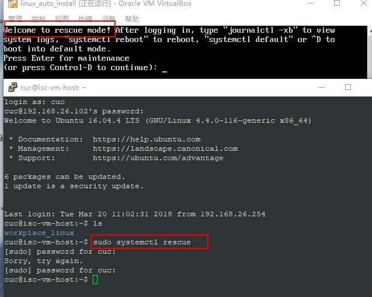
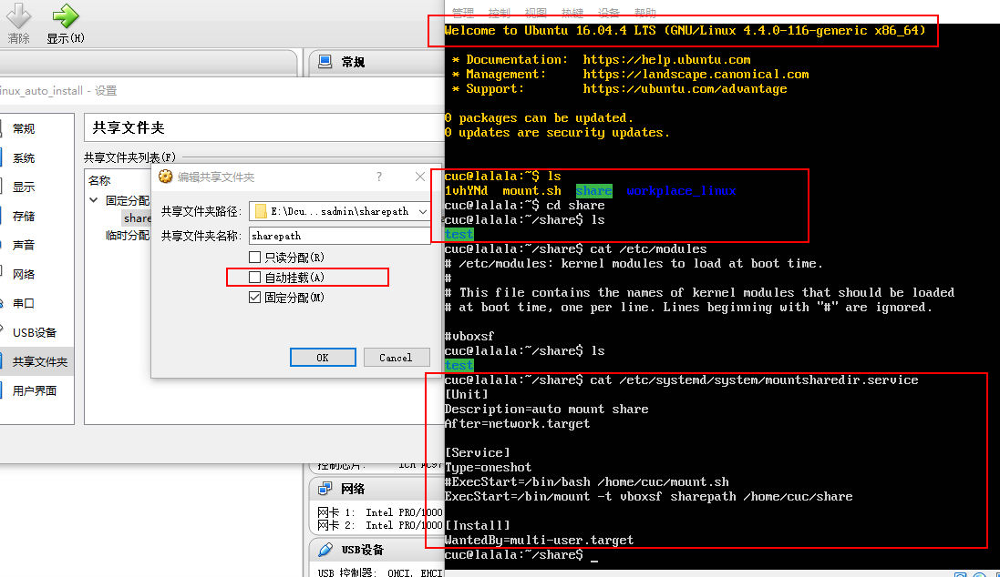
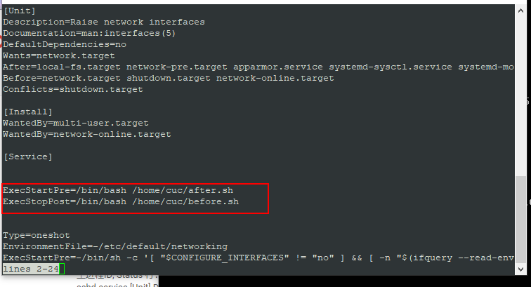
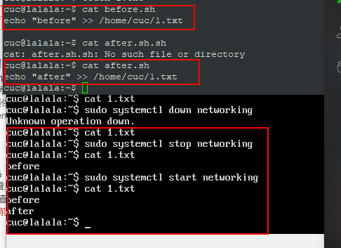

## 动手实践systemd

注：

- 部分带有重启、关机及类似操作的实践没有录视频  部分图片文档说明

### 命令篇

- systemctl 

  - cho重启、切断电源、CPU停止工作、暂停系统 

  - 进入交互式休眠状态（进入冬眠状态相同）
     
    

    关于错误信息 :https://github.com/systemd/systemd/issues/6729 

  - 进入救援模式

    

- systemd-analyze + hostnamectl+localectl

  - 视频链接：https://asciinema.org/a/NDaWQFXGdPGLMODtRxfKOm5Yp
  - 说明：
    - hostname 
      - 提升权限后执行（sudo）的命令可以执行，但是会报错误：sudo: unable to resolve host lalala
      - 根据https://askubuntu.com/questions/59458/error-message-sudo-unable-to-resolve-host-user  保持文件一致 例如在/etc/hosts中添加``` 127.0.1.1    yourhostname```  即可解决
    - 更改本地化参数中的语言设置 重启生效

- timedatectl + loginctl+Unit + Target

  - 视频链接：
    - https://asciinema.org/a/hnjzbpp5IrwDCVO5kkogFoBX3
    - https://asciinema.org/a/F1hpnx12bEFkqAMinr0n2Ae3P

- journalctl

  - 视频链接：https://asciinema.org/a/kuwPormj6BoNg8BqJsoCyojBS

### 实战篇

- 关于命令的部分都在之前的视频中执行过，主要就阅读了内容
- 视频链接（只有不到30秒）：https://asciinema.org/a/BtMS0yfBVaM7oXZUHlU968Jo6

### 本章自查清单

- 如何添加一个用户并使其具备sudo执行程序的权限？

  ```bash
  adduser username 
  #添加用户
  sudo usermod -aG sudo username
  # 将用户添加到sudo组
  ```

- 如何将一个用户添加到一个用户组？

  ```shell
  sudo usermod -aG groupname username
  ```

- 如何查看当前系统的分区表和文件系统详细信息？

  ```shell
  fdisk -l  
  # 或 df -T
  ```

- 如何实现开机自动挂载Virtualbox的共享目录分区？

  ```bash
  #安装增强功能 https://virtualboxes.org/doc/installing-guest-additions-on-ubuntu/
  #手动将iso文件挂载 然后mount将/dev/cdrom挂载 注意关机手动挂载（或重启
  #编辑/etc/systemd/system/Auto_mount_service_file.service
  sudo systemctl enable  Auto_mount_service_file.service
  # 注意全部都要绝对路径
  # 问题 ：根据原文 ：“上面的命令相当于在/etc/systemd/system目录添加一个符号链接，指向/usr/lib/systemd/system里面的httpd.service文件。” 应该不用enable也可以 但是没有enable就不能开机执行
  ```
  

- 基于LVM（逻辑分卷管理）的分区如何实现动态扩容和缩减容量？

  

  - 单纯完成了作业要求

- 如何通过systemd设置实现在网络连通时运行一个指定脚本，在网络断开时运行另一个脚本？

  - 在networking.service的设置文件中添加：

  

  - 结果

    

    - 问题
      - 在语义上 认为通过before(after) network-online.target 就可以 但是实际上，通过测试却不可以 判断无效 （https://www.freedesktop.org/wiki/Software/systemd/NetworkTarget/）
      - 在这里，我把网络连通简单地定义为了网络服务是否在运行中 
      - 如果想实现与互联网联通性的判断可以通过脚本实现 开机运行脚本就可以了 

- 如何通过systemd设置实现一个脚本在任何情况下被杀死之后会立即重新启动？实现**杀不死**？

  ```shell
  #举例：
  $ systemctl cat mysql.service
  # /lib/systemd/system/mysql.service
  # MySQL systemd service file

  [Unit]
  Description=MySQL Community Server
  After=network.target

  [Install]
  WantedBy=multi-user.target

  [Service]
  User=mysql
  Group=mysql
  PermissionsStartOnly=true
  ExecStartPre=/usr/share/mysql/mysql-systemd-start pre
  ExecStart=/usr/sbin/mysqld
  ## 添加 ExecStopPost=/usr/sbin/mysqld
  ## restart = always 为什么不行？ （always：不管是什么退出原因，总是重启）
  ExecStartPost=/usr/share/mysql/mysql-systemd-start post
  TimeoutSec=600
  Restart=on-failure
  RuntimeDirectory=mysqld
  RuntimeDirectoryMode=755
  ```

  

  但相应的问题就是相关的stop指令执行不了了


​	
